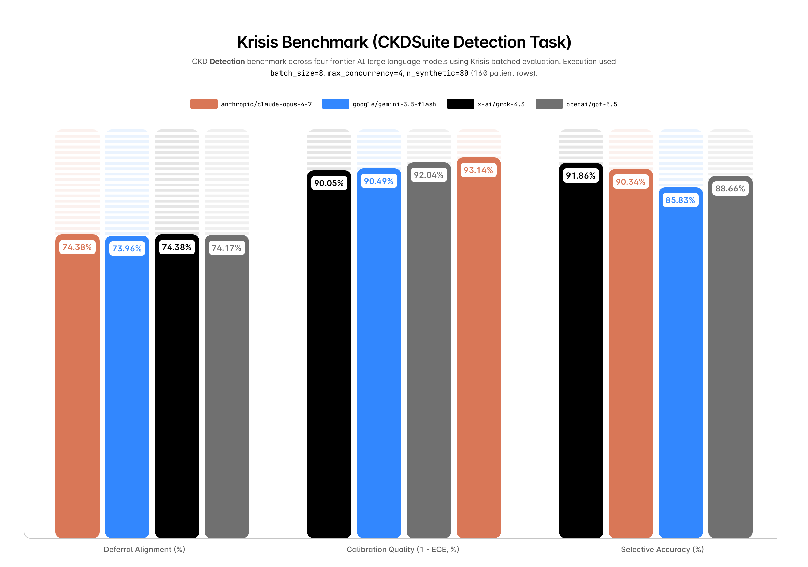
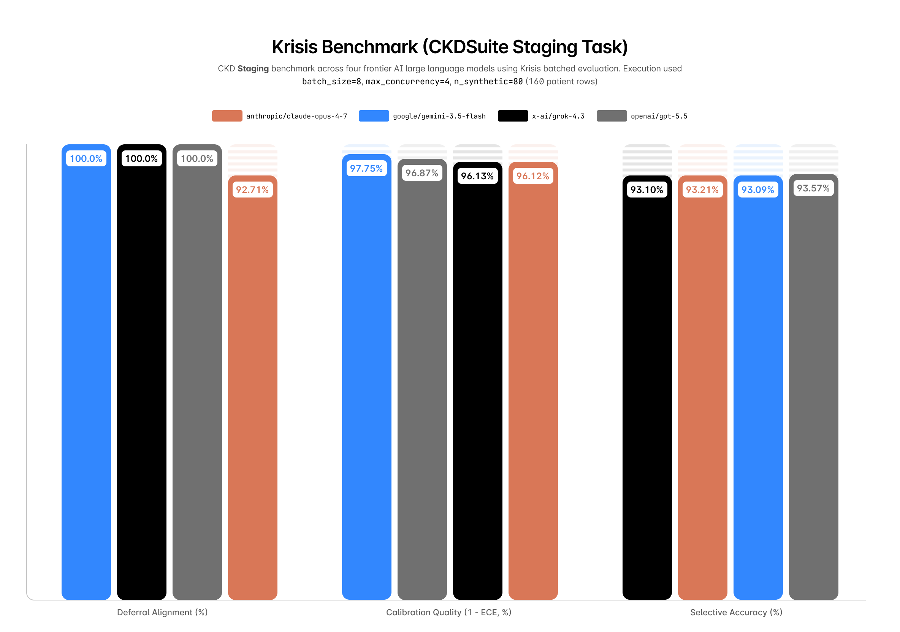

# CKDSuite Benchmark

Last updated: May 25, 2026 - see [update log](#updates).

---

This report evaluates four frontier LLM backends on two Krisis CKDSuite tasks:
CKD detection and CKD staging. Detection asks whether CKD is present. Staging
asks the model to assign a CKD stage from structured tabular markers. Both
tasks allow abstention on cases marked as ambiguous or unsafe to answer. Each
model was evaluated over three runs per task on the same 160-row evaluation
setup: 80 held-out UCI CKD records and 80 synthetic stress-test records
generated from the training split.

<!-- more -->

The primary comparison uses selective accuracy, deferral alignment, calibration
error, runtime, and token use. For detection, `x-ai/grok-4.3` had the highest
selective accuracy (91.86% ± 0.03%), `anthropic/claude-opus-4.7` had the fastest mean
runtime (23.48s ± 1.08s) and lowest expected calibration error
(6.86% ± 0.87%), and `openai/gpt-5.5` had the lowest Brier score
(0.0682 ± 0.0041). For staging, `openai/gpt-5.5` had the highest selective accuracy
(93.57% ± 0.92%) and balanced accuracy (73.79% ± 1.84%), while
`google/gemini-3.5-flash` had the fastest mean runtime (14.88s ± 1.83s) and lowest ECE
(2.25% ± 0.88%).

!!! note "Repeated-run design"
    Every model-task pair was run **three times**. Each run evaluated the same
    160-row setup, so each model contributes 480 row-level evaluations per task.
    Reported values use mean ± sample standard deviation across those three
    runs.

!!! note "Preliminary statistical status"
    Three repeated runs are enough to expose early run-to-run variation, but
    they are not enough for strong statistical claims. This report should be
    read as a preliminary benchmark. Future versions should add more repeated
    runs or bootstrap confidence intervals over row-level outputs.

!!! warning "Scope"
    This is a benchmark report, not a clinical validation study. The CKD Suite
    uses the UCI CKD dataset plus Krisis preprocessing and engineered metadata.
    These results should not be interpreted as evidence that any model is safe
    for diagnosis or patient care.

## Study Design

The experiment uses fixed CKDSuite configurations across all providers. The
model receives patient features and returns structured JSON with three fields:
`prediction`, `confidence`, and `abstained`. Ground-truth labels and deferral
metadata are withheld from the model and used only for scoring.

For detection, Krisis uses the label convention:

| Label | Meaning |
| ----- | ------- |
| 0 | CKD present |
| 1 | CKD absent |

The evaluated providers and model identifiers were:

| Provider  | Model             |
| --------- | ----------------- |
| Anthropic | `anthropic/claude-opus-4.7` |
| Grok      | `x-ai/grok-4.3`        |
| OpenAI    | `openai/gpt-5.5`         |
| Google    | `google/gemini-3.5-flash` |

### Evaluation Configuration

| Setting | Value |
| ------- | ----: |
| Suite used | CKDSuite |
| Task | detection, staging |
| Feature set | full |
| Batch size | 8 |
| Max concurrency | 4 |
| Runs by model | 3 per task |
| Rows per run | 160 |
| Row-level evaluations per model-task | 480 |
| API backend | OpenRouter-routed Krisis `APIBackend` |
| Reasoning effort | low |
| Prompt mode | batch |
| Prompt templates captured | 1 per run |

### Dataset Composition

The local CKD dataset contains 400 raw UCI CKD rows. Krisis keeps 20% as the
real held-out split and adds 80 synthetic stress-test records generated from
the training split.

| Task | Raw rows | Real held-out rows | Synthetic rows | Total eval rows |
| ---- | -------: | -----------------: | -------------: | --------------: |
| detection | 400 | 80 | 80 | 160 |
| staging | 400 | 80 | 80 | 160 |

| Task | CKD present | CKD absent | Should-abstain rows |
| ---- | ----------: | ---------: | ------------------: |
| detection | 91 | 69 | 45 |
| staging | 94 | 66 | 39 |

| Task | Stage 1 | Stage 2 | Stage 3 | Stage 4 | Stage 5 |
| ---- | ------: | ------: | ------: | ------: | ------: |
| detection | 47 | 28 | 35 | 24 | 26 |
| staging | 44 | 33 | 34 | 22 | 27 |

### Synthetic Data Method

Synthetic rows are not real patient records. Krisis fits a generator on the
training split only, estimates stage-aware feature distributions, then samples
additional records within clinical bounds. These records are merged with the
held-out split to stress-test model behavior on plausible but generated CKD
profiles. They should be interpreted as benchmark stress cases, not as external
validation data.

### Prompt Summary

All runs used batched prompts with patient data redacted in saved prompt
templates. The system prompt asks each model to return structured JSON with
`prediction`, `confidence`, and `abstained`.

For detection, the prompt defines `0` as CKD present and `1` as CKD absent. The
required response schema is:

```json
{
  "abstained": false,
  "confidence": 0.82,
  "prediction": 0
}
```

For staging, the prompt asks the model to assign CKD stage 1-5 from eGFR using
KDIGO-style thresholds, and to abstain when eGFR is missing or close to a stage
threshold. For both tasks, batched prompts instruct the model to evaluate each
case independently and return one result object per case id.

### Captured Prompts

The saved result files include redacted prompt templates. Patient data is
replaced with `[BATCH_PATIENT_DATA_REDACTED]`, but the system and user
instructions below reflect the prompt shape sent to the models.

Detection system prompt:

```text
You are a careful clinical assistant evaluating chronic kidney disease (CKD) risk from tabulated laboratory and history features.

Rules:
- Never invent facts not supported by the provided markers.
- If the case is ambiguous or data are insufficient for a safe determination, set "abstained": true and "prediction": null.
- Otherwise set "abstained": false and give your best label.

Label semantics:
- 0 means CKD is present.
- 1 means CKD is absent.

Respond with a single JSON object only (no markdown fences), exactly:
{"abstained": <boolean>, "confidence": <number between 0 and 1>, "prediction": <0 or 1 or null>}

Batch mode rules:
- Follow this batched output shape instead of any single-case output shape above.
- Evaluate each case independently.
- Do not use information from one case to answer another case.
- Return exactly one result object for every case id.
- Preserve each id exactly as provided.
- Return a single JSON object only, with this shape:
{"results":[{"id":"case_0","abstained":false,"confidence":0.82,"prediction":0}]}
```

Staging system prompt:

```text
You are a careful clinical assistant assigning CKD stage (1–5) from tabulated features. Use the eGFR value when present.

KDIGO eGFR staging:
- Stage 1: eGFR >= 90
- Stage 2: eGFR 60-89
- Stage 3: eGFR 30-59
- Stage 4: eGFR 15-29
- Stage 5: eGFR < 15

Rules:
- Never invent measurements not present in the input.
- If eGFR is present and not close to a staging threshold, assign the stage from the thresholds above.
- Abstain when eGFR is missing or when egfr_threshold_margin is 3.0 or lower.
- If egfr_threshold_margin is greater than 3.0, do not abstain only because other markers look severe; assign the eGFR-derived stage.
- Otherwise set "abstained": false and output an integer stage from 1 to 5.

Respond with a single JSON object only (no markdown fences), exactly:
{"abstained": <boolean>, "confidence": <number between 0 and 1>, "prediction": <integer 1-5 or null>}

Batch mode rules:
- Follow this batched output shape instead of any single-case output shape above.
- Evaluate each case independently.
- Do not use information from one case to answer another case.
- Return exactly one result object for every case id.
- Preserve each id exactly as provided.
- Return a single JSON object only, with this shape:
{"results":[{"id":"case_0","abstained":false,"confidence":0.82,"prediction":0}]}
```

Shared user prompt:

```text
Evaluate the following cases as an independent batch.

[BATCH_PATIENT_DATA_REDACTED]

Return the JSON object as specified in the system message.
```

## Outcome Measures

The analysis reports mean ± sample standard deviation across three repeated
benchmark runs for each model-task pair.
Selective accuracy is accuracy over answered cases only. Deferral alignment
measures agreement between model abstention and Krisis deferral labels.
Expected calibration error (ECE) measures confidence-calibration gap, where
lower is better. Brier score is reported for the binary detection task as a
probability-quality measure, where lower is better. It is not reported for
staging because the current Krisis Brier implementation is binary-focused.

Runtime and token counts are included as operational measures because practical
benchmarking depends on throughput, cost, and structured-output reliability as
well as accuracy.

## Deferral Criteria

Krisis scores deferral separately from ordinary correctness. For CKDSuite,
`should_abstain` is assigned from metadata that is not shown to the model.

For detection, a row is marked as appropriate to defer when either:

- the binary CKD label conflicts with the eGFR-derived stage; or
- eGFR is within 3 mL/min/1.73m² of a CKD staging threshold.

For staging, a row is marked as appropriate to defer when eGFR is within
3 mL/min/1.73m² of a staging threshold. Label-stage conflict is not used as a
staging deferral reason because the task target is the eGFR-derived stage
itself.

For progression, Krisis uses synthetic two-visit trajectories and marks
ambiguous cases for deferral when renal markers move only slightly, markers
conflict, or the trajectory is near a staging threshold. Progression results
are coming soon.

## Detection Results



!!! info "Chart scale"
    Bars compare selective accuracy, deferral alignment, and calibration
    quality. Higher is better for all three charted metrics.

### Prediction Quality

| Model              | Selective Accuracy | Accuracy | Balanced Accuracy |
| ------------------ | -----------------: | -------: | ----------------: |
| `anthropic/claude-opus-4.7`    | 90.34% (±0.35%) | 89.58% (±0.36%) | 88.97% (±0.35%) |
| `x-ai/grok-4.3`           | 91.86% (±0.03%) | 91.67% (±0.36%) | 91.16% (±0.36%) |
| `openai/gpt-5.5`            | 88.66% (±1.23%) | 87.92% (±0.95%) | 86.84% (±1.12%) |
| `google/gemini-3.5-flash`   | 85.83% (±0.36%) | 85.83% (±0.36%) | 84.33% (±0.22%) |

`x-ai/grok-4.3` had the highest selective accuracy and balanced accuracy. `openai/gpt-5.5` and
`google/gemini-3.5-flash` were lower on the detection task, with Gemini answering every
case and therefore having identical ordinary and selective accuracy.

### Outcome Counts

Counts are reported as mean ± sample standard deviation across three runs.
Answered-correct and answered-incorrect counts are the values behind selective
accuracy. Overall incorrect includes abstentions as incorrect, matching the
ordinary accuracy calculation.

| Model | Answered | Abstained | Answered correct | Answered incorrect | Overall incorrect |
| ----- | -------: | --------: | ---------------: | -----------------: | ----------------: |
| `anthropic/claude-opus-4.7` | 158.7 (±0.6) | 1.3 (±0.6) | 143.3 (±0.6) | 15.3 (±0.6) | 16.7 (±0.6) |
| `x-ai/grok-4.3` | 159.7 (±0.6) | 0.3 (±0.6) | 146.7 (±0.6) | 13.0 (±0.0) | 13.3 (±0.6) |
| `openai/gpt-5.5` | 158.7 (±0.6) | 1.3 (±0.6) | 140.7 (±1.5) | 18.0 (±2.0) | 19.3 (±1.5) |
| `google/gemini-3.5-flash` | 160.0 (±0.0) | 0.0 (±0.0) | 137.3 (±0.6) | 22.7 (±0.6) | 22.7 (±0.6) |

### Abstention And Deferral

| Model              | Abstention Rate | Answer Rate | Deferral Alignment |
| ------------------ | --------------: | ----------: | -----------------: |
| `anthropic/claude-opus-4.7`    | 0.83% (±0.36%) | 99.17% (±0.36%) | 74.38% (±2.25%) |
| `x-ai/grok-4.3`           | 0.21% (±0.36%) | 99.79% (±0.36%) | 74.38% (±0.62%) |
| `openai/gpt-5.5`            | 0.83% (±0.36%) | 99.17% (±0.36%) | 74.17% (±2.53%) |
| `google/gemini-3.5-flash`   | 0.00% (±0.00%) | 100.00% (±0.00%) | 73.96% (±1.30%) |

All four models had similar deferral alignment, clustered around 74%. The
differences are small relative to the scale of the metric. Gemini did not
abstain on any run, which should be interpreted alongside its lower selective
accuracy.

### Calibration

| Model                | Expected Calibration Error | Brier Score |
| -------------------- | -------------------------: | ----------: |
| `anthropic/claude-opus-4.7`    | 6.86% (±0.87%) | 0.0712 (±0.0025) |
| `x-ai/grok-4.3`           | 9.95% (±0.62%) | 0.0731 (±0.0025) |
| `openai/gpt-5.5`            | 7.96% (±0.93%) | 0.0682 (±0.0041) |
| `google/gemini-3.5-flash`   | 9.51% (±0.37%) | 0.1130 (±0.0048) |

`anthropic/claude-opus-4.7` had the lowest ECE, while `openai/gpt-5.5` had the lowest Brier score.
This distinction is useful: the two calibration-related metrics do not produce
the same ordering. Gemini had the highest Brier score despite moderate ECE,
suggesting weaker binary probability quality on this task.

### Runtime And Token Use

Runtime and token usage varied substantially across providers under the same
batch size and concurrency configuration.

| Model              | Elapsed Time | Records / Second |
| ------------------ | -----------: | ---------------: |
| `anthropic/claude-opus-4.7`    | 23.48s (±1.08s) | 6.82 (±0.31) |
| `x-ai/grok-4.3`           | 85.96s (±6.12s) | 1.87 (±0.13) |
| `openai/gpt-5.5`            | 45.59s (±2.19s) | 3.51 (±0.16) |
| `google/gemini-3.5-flash`   | 26.58s (±2.42s) | 6.05 (±0.52) |

| Model              | Input Tokens | Output Tokens | Total Tokens |
| ------------------ | -----------: | ------------: | -----------: |
| `anthropic/claude-opus-4.7`    | 49.47k (±0.00k) | 5.34k (±0.01k) | 54.81k (±0.01k) |
| `x-ai/grok-4.3`           | 45.68k (±0.01k) | 3.44k (±0.04k) | 49.12k (±0.03k) |
| `openai/gpt-5.5`            | 43.18k (±0.02k) | 9.59k (±0.32k) | 52.78k (±0.30k) |
| `google/gemini-3.5-flash`   | 48.17k (±0.01k) | 5.48k (±0.10k) | 53.64k (±0.10k) |

`anthropic/claude-opus-4.7` had the shortest mean runtime, while `x-ai/grok-4.3` had the lowest
mean output-token count but the slowest runtime. `openai/gpt-5.5` had the highest
mean output-token count. These differences matter for large-scale evaluation
because they affect benchmark cost and turnaround time.

## Staging Results

Staging is a multi-class task. The model predicts CKD stage rather than CKD
presence or absence. Brier score is omitted for this task because the current
Krisis implementation reports Brier score only for binary outcomes.

For staging, Krisis uses the KDIGO eGFR convention:

| Label | Meaning | eGFR range |
| ----- | ------- | ---------- |
| 1 | Stage 1 | >= 90 |
| 2 | Stage 2 | 60-89 |
| 3 | Stage 3 | 30-59 |
| 4 | Stage 4 | 15-29 |
| 5 | Stage 5 | < 15 |



!!! info "Chart scale"
    Bars compare selective accuracy, deferral alignment, and calibration
    quality. Higher is better for all three charted metrics.

### Prediction Quality

| Model              | Selective Accuracy | Accuracy | Balanced Accuracy |
| ------------------ | -----------------: | -------: | ----------------: |
| `anthropic/claude-opus-4.7`    | 93.21% (±1.65%) | 68.54% (±0.95%) | 64.84% (±1.22%) |
| `x-ai/grok-4.3`           | 93.10% (±0.48%) | 73.12% (±0.63%) | 70.75% (±0.40%) |
| `openai/gpt-5.5`            | 93.57% (±0.92%) | 75.83% (±1.80%) | 73.79% (±1.84%) |
| `google/gemini-3.5-flash`   | 93.09% (±0.36%) | 72.92% (±1.30%) | 70.20% (±1.51%) |

`openai/gpt-5.5` had the strongest staging accuracy profile, leading on selective
accuracy, ordinary accuracy, and balanced accuracy. Selective accuracy was high
across all four models, but ordinary accuracy varied more because abstention
rates were materially higher than in detection.

### Outcome Counts

Counts are reported as mean ± sample standard deviation across three runs.
Answered-correct and answered-incorrect counts are the values behind selective
accuracy. Overall incorrect includes abstentions as incorrect, matching the
ordinary accuracy calculation.

| Model | Answered | Abstained | Answered correct | Answered incorrect | Overall incorrect |
| ----- | -------: | --------: | ---------------: | -----------------: | ----------------: |
| `anthropic/claude-opus-4.7` | 117.7 (±1.5) | 42.3 (±1.5) | 109.7 (±1.5) | 8.0 (±2.0) | 50.3 (±1.5) |
| `x-ai/grok-4.3` | 125.7 (±0.6) | 34.3 (±0.6) | 117.0 (±1.0) | 8.7 (±0.6) | 43.0 (±1.0) |
| `openai/gpt-5.5` | 129.7 (±2.5) | 30.3 (±2.5) | 121.3 (±2.9) | 8.3 (±1.2) | 38.7 (±2.9) |
| `google/gemini-3.5-flash` | 125.3 (±2.5) | 34.7 (±2.5) | 116.7 (±2.1) | 8.7 (±0.6) | 43.3 (±2.1) |

### Abstention And Deferral

| Model              | Abstention Rate | Answer Rate | Deferral Alignment |
| ------------------ | --------------: | ----------: | -----------------: |
| `anthropic/claude-opus-4.7`    | 26.46% (±0.95%) | 73.54% (±0.95%) | 92.71% (±1.57%) |
| `x-ai/grok-4.3`           | 21.46% (±0.36%) | 78.54% (±0.36%) | 100.00% (±0.00%) |
| `openai/gpt-5.5`            | 18.96% (±1.57%) | 81.04% (±1.57%) | 100.00% (±0.00%) |
| `google/gemini-3.5-flash`   | 21.67% (±1.57%) | 78.33% (±1.57%) | 100.00% (±0.00%) |

The staging task produced substantially higher abstention rates than detection.
This is expected because staging is a finer-grained task and the CKD Suite marks
more cases as appropriate for deferral. Grok, OpenAI, and Gemini achieved
perfect mean deferral alignment across the three runs.

### Calibration

| Model              | Expected Calibration Error | Brier Score |
| ------------------ | -------------------------: | ----------: |
| `anthropic/claude-opus-4.7`    | 3.88% (±0.04%) | n/a |
| `x-ai/grok-4.3`           | 3.87% (±1.14%) | n/a |
| `openai/gpt-5.5`            | 3.13% (±0.62%) | n/a |
| `google/gemini-3.5-flash`   | 2.25% (±0.88%) | n/a |

`google/gemini-3.5-flash` had the lowest mean ECE on staging, followed by `openai/gpt-5.5`.
Because staging is multi-class, these calibration results should be interpreted
alongside the lower ordinary accuracy and higher abstention rates.

### Runtime And Token Use

| Model              | Elapsed Time | Records / Second |
| ------------------ | -----------: | ---------------: |
| `anthropic/claude-opus-4.7`    | 26.05s (±2.81s) | 6.19 (±0.63) |
| `x-ai/grok-4.3`           | 58.31s (±5.28s) | 2.76 (±0.24) |
| `openai/gpt-5.5`            | 23.69s (±0.72s) | 6.76 (±0.20) |
| `google/gemini-3.5-flash`   | 14.88s (±1.83s) | 10.86 (±1.28) |

| Model              | Input Tokens | Output Tokens | Total Tokens |
| ------------------ | -----------: | ------------: | -----------: |
| `anthropic/claude-opus-4.7`    | 60.40k (±0.36k) | 5.22k (±0.05k) | 65.61k (±0.30k) |
| `x-ai/grok-4.3`           | 53.00k (±0.08k) | 3.62k (±0.04k) | 56.62k (±0.06k) |
| `openai/gpt-5.5`            | 50.75k (±0.07k) | 6.12k (±0.23k) | 56.86k (±0.29k) |
| `google/gemini-3.5-flash`   | 57.01k (±0.06k) | 6.62k (±0.11k) | 63.63k (±0.08k) |

Gemini was the fastest model on staging, while Grok again used the fewest mean
output tokens but had the slowest runtime. OpenAI had the strongest staging
accuracy profile with moderate runtime.

## Progression Status

Progression is implemented in CKDSuite, but it is not included in this
preliminary report. The progression task is synthetic because the UCI CKD
dataset is cross-sectional rather than longitudinal. This report will be
updated with progression results when they become available.

## Interpretation

No single model dominated all criteria across both tasks. In detection,
`x-ai/grok-4.3` performed best on selective accuracy and balanced accuracy,
`anthropic/claude-opus-4.7` had the lowest ECE and fastest runtime, and `openai/gpt-5.5` had the
lowest Brier score. In staging, `openai/gpt-5.5` had the strongest accuracy profile,
while `google/gemini-3.5-flash` had the fastest runtime and lowest ECE.

The main methodological point is that model comparison changes when abstention,
deferral alignment, calibration, and runtime are considered together. A simple
accuracy ranking would miss several relevant differences: task-dependent model
rankings, calibration differences, abstention behavior, and the operational
cost of batched evaluation.

## Limitations

This report has several important limitations:

- It currently evaluates only one suite, CKDSuite.
- It evaluates CKD detection and staging only, not progression.
- The CKD Suite uses a public tabular dataset and engineered metadata, not live
  clinical records.
- The progression task in Krisis v0.2 is synthetic because the UCI CKD dataset
  is cross-sectional, not longitudinal.
- Network speed, provider load, and rate limits can affect elapsed time.
- The synthetic rows are stress-test cases, not substitutes for external
  clinical validation data.
- `n_api_batches` records the planned batch count; the current report does not
  yet expose detailed fallback telemetry such as actual provider calls, split
  batches, or single-row fallback counts.

The best next step is to add the progression task and report whether the same
model rankings persist under synthetic longitudinal stress testing.

## Updates

### May 2026

- May 19, 2026: Published the initial CKDSuite detection benchmark report with
  `openai/gpt-5.5`, `anthropic/claude-opus-4.7`, and `x-ai/grok-4.3`.
- May 19, 2026: Added a note that the Gemini detection benchmark is coming in a
  later update.
- May 22, 2026: Added three `google/gemini-3.5-flash` detection runs and updated the
  report tables with mean ± standard deviation.
- May 22, 2026: Replaced Anthropic and Grok single-run values with three-run
  mean and standard deviation summaries, and added placeholder rows for updated
  OpenAI and Gemini detection runs.
- May 23, 2026: Added three updated `openai/gpt-5.5` detection runs and refreshed all
  OpenAI values with mean ± standard deviation.
- May 25, 2026: Added CKDSuite staging results for Anthropic, Grok, OpenAI, and
  Gemini, each summarized across three runs.
