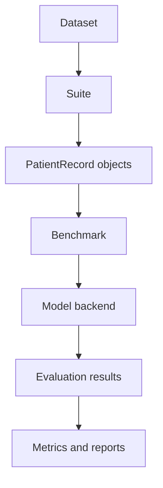

# Framework Guide

The framework guide explains how Krisis is organized as a clinical evaluation
framework: what data it accepts, how suites turn data into tasks, how models are
called, what metrics mean, and how results should be reported.

!!! warning "Current scope"
    Krisis v0.1 has one implemented clinical domain: Chronic Kidney Disease
    (CKD). Diabetes and hypertension are listed as planned domains, but they are
    not implemented yet.

!!! note "Code examples are CKD-first"
    Most example snippets use `CKDSuite` because it is the only suite available
    in v0.1. Treat those snippets as examples of the Krisis framework pattern,
    not as proof that every clinical domain is already implemented.

## What To Read First

| Page | Use it when you want to understand |
|---|---|
| [Datasets](datasets/index.md) | supported source data, dataset policy, and why Krisis does not bundle clinical CSV files |
| [Suites](suites/index.md) | how raw rows become benchmark-ready `PatientRecord` objects |
| [Metrics](metrics.md) | how correctness, abstention, deferral, and calibration are scored |
| [Model Backends](backends.md) | how OpenAI, Anthropic, Grok, and Gemini are plugged into the same interface |
| [Outputs](outputs.md) | text reports, full JSON, metrics-only JSON, and plotting fields |
| [Research Status](research.md) | what Krisis v0.1 does and does not claim |

## Framework Shape

Krisis separates these pieces deliberately:

- datasets define the source and scope of clinical data
- suites define task labels, preprocessing, and benchmark metadata
- backends define how LLM providers are called
- metrics define how answers, abstentions, confidence, and deferrals are scored
- reports define how results are inspected, exported, and compared

That separation is what lets the same CKD task run against multiple frontier LLM
providers while producing a standard result object.

## Recommended Path

For a first full run:

1. Read the [CKD dataset card](datasets/ckd.md).
2. Read the [CKD suite guide](suites/ckd.md).
3. Choose a backend from [Model Backends](backends.md).
4. Run a benchmark with conservative batching.
5. Use [Outputs](outputs.md) to export metrics-only JSON for comparison plots.
6. Interpret results using the caveats in [Research Status](research.md).
