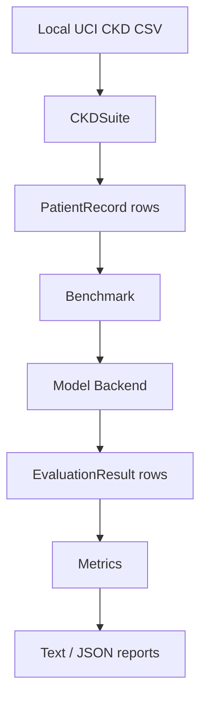

# Krisis

Clinical evaluation framework for testing LLM safety behavior in medical
reasoning.

Pronounced **kree-sis**. You can hear an audio pronunciation for
[`krisis`](https://www.howtopronounce.com/krisis).

Krisis evaluates not only whether an LLM is correct, but whether it knows when
to abstain, defer, or express uncertainty in high-stakes clinical tasks.

!!! warning "Research software, not clinical software"
    Krisis is for evaluation and research. It is not a medical device and must
    not be used to diagnose, treat, or triage patients.

## Why Krisis Exists

Krisis grew out of [Cady AI](https://x.com/devsgnr_/status/1996591411441852793?s=20), an earlier CKD
detection chatbot presented at a national AI hackathon. Cady AI used a model
trained on the UCI Chronic Kidney Disease dataset to predict CKD/not-CKD,
return class probabilities, and attribute which lab results pushed risk upward.

That project exposed the next safety question: as LLMs become more fluent in
clinical reasoning, can they recognize cases where they should not confidently
answer?

Krisis turns that question into a reusable evaluation framework: a
human-in-the-loop type system for checking whether LLMs can defer,
abstain, and express uncertainty before their outputs are trusted.

## What Krisis Provides

| Layer | What it does |
|---|---|
| Suites | Convert clinical datasets into benchmark-ready `PatientRecord` objects |
| Backend | Routes OpenAI, Anthropic, Grok, Gemini, and other models through `APIBackend` |
| Benchmark runner | Runs batched/concurrent evaluations with retries and fallbacks |
| Metrics | Scores accuracy, calibration, abstention, coverage, and deferral behavior |
| Reports | Emits text, full JSON, and metrics-only JSON outputs |

## Current Scope

Krisis v0.2 includes one implemented clinical suite: Chronic Kidney Disease
(CKD), based on the UCI CKD dataset.

Supported CKD tasks:

- `detection`: CKD vs not CKD
- `staging`: CKD stage classification
- `progression`: synthetic progression stress test

!!! important "Progression is synthetic"
    The UCI CKD dataset is cross-sectional, not longitudinal. Krisis creates
    synthetic two-visit trajectories for progression stress testing. These are
    useful for evaluating reasoning and deferral behavior, but they are not
    real longitudinal CKD outcomes.

## Typical Workflow

## Next Steps

- Start with [Getting Started](getting-started.md) to run a benchmark.
- Read [Core Concepts](concepts.md) to understand the framework design.
- Use [API Reference](api/index.md) when integrating Krisis in code.
