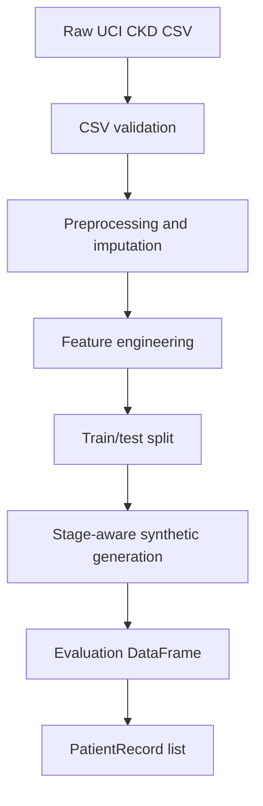

# CKD Suite

`CKDSuite` is built for the UCI Machine Learning Repository Chronic Kidney
Disease dataset.

!!! warning "UCI schema only"
    For v0.2, `CKDSuite` expects the UCI CKD schema only. Do not pass arbitrary
    CKD exports, EHR tables, or custom clinical CSVs directly into this suite
    unless they have first been mapped into the UCI CKD column schema and value
    conventions.

## Loading Data

```python
from krisis.data.base import FeatureSet, SuiteConfig, Task
from krisis.data.ckd.suite import CKDSuite

suite = CKDSuite(
    data_path="/path/to/ckd_full.csv",
    config=SuiteConfig(
        features=FeatureSet.FULL,
        task=Task.STAGING,
        n_synthetic=80,
        seed=42,
        test_size=0.2,
    ),
)

records = suite.load()
description = suite.describe()
```

## Pipeline



## Feature Engineering Criteria

`CKDSuite` uses `CKDFeatureEngineer` to derive clinical fields that are not
directly available in the UCI CSV.

| Field | How Krisis derives it |
|---|---|
| `sex` | If a real sex column is not provided, Krisis generates sex using a reproducible creatinine-conditioned heuristic. Serum creatinine `<= 0.7` biases female, `0.7 < sc <= 0.9` is ambiguous, and `> 0.9` biases male. |
| `egfr` | Computed with the race-free CKD-EPI 2021 creatinine equation using serum creatinine, age, and sex. |
| `ckd_stage` | Assigned from eGFR using KDIGO GFR categories: G1 `>=90`, G2 `60-89`, G3 `30-59`, G4 `15-29`, G5 `<15`. Stage 3 is combined by default. |
| `should_abstain` | Evaluation-only metadata for deferral scoring. It marks cases near eGFR thresholds or cases where the binary CKD label conflicts with eGFR-derived stage. |

!!! warning "Engineered fields are benchmark assumptions"
    `egfr` and `ckd_stage` follow clinical references, but synthetic sex and
    deferral labels are benchmark assumptions. They are documented so users can
    interpret results honestly.

References:

- [National Kidney Foundation CKD-EPI Creatinine Equation (2021)](https://www.kidney.org/ckd-epi-creatinine-equation-2021-0)
- [KDIGO 2024 CKD Guideline](https://kdigo.org/guidelines/ckd-evaluation-and-management/kdigo-2024-ckd-guideline/)
- [UCI Chronic Kidney Disease dataset](https://archive.ics.uci.edu/dataset/336/chronic+kidney+disease)

## Expected CKD Columns

The UCI CKD dataset contains an ID column, clinical feature columns, and a class
label column. Krisis expects the standard UCI feature names and value
conventions.

| Numeric column | Meaning |
|---|---|
| `age` | age |
| `bp` | blood pressure |
| `sg` | urine specific gravity |
| `al` | albumin |
| `su` | sugar |
| `bgr` | blood glucose random |
| `bu` | blood urea |
| `sc` | serum creatinine |
| `sod` | sodium |
| `pot` | potassium |
| `hemo` | hemoglobin |
| `pcv` | packed cell volume |
| `wbcc` | white blood cell count |
| `rbcc` | red blood cell count |

| Categorical column | Meaning |
|---|---|
| `rbc` | red blood cells |
| `pc` | pus cell |
| `pcc` | pus cell clumps |
| `ba` | bacteria |
| `htn` | hypertension |
| `dm` | diabetes mellitus |
| `cad` | coronary artery disease |
| `appet` | appetite |
| `pe` | pedal edema |
| `ane` | anemia |

| Target column | Supported labels |
|---|---|
| `class` | `ckd`, `notckd` |

## Validation

Before preprocessing, Krisis checks:

- the CSV is not empty
- required columns are present
- no unexpected columns are present
- column names are unique
- numeric columns contain numeric values when present
- categorical columns contain supported UCI values
- `id` is non-missing and unique
- `class` is non-missing and contains both labels

!!! note "Known UCI-derived artefacts"
    Some CKD CSV copies contain rare categorical artefacts caused by
    column-shifted values. Krisis treats known one-off `appet`/`pe` artefacts
    as missing values so the imputer can handle them safely.

## Feature Sets

| Feature set | Meaning |
|---|---|
| `FeatureSet.FULL` | exposes the full UCI-derived clinical feature set |
| `FeatureSet.REDUCED` | exposes the canonical reduced feature set used by the original CKD notebook workflow |

`FULL` is the default recommendation for LLM-facing benchmarks because it
preserves messier clinical context.

## Tasks

### Detection

Predict whether the patient is CKD-positive or CKD-negative.

### Staging

Predict CKD stage derived from eGFR. Krisis also exposes eGFR threshold context
to make the task clinically interpretable.

### Progression

Predict whether a synthetic two-visit trajectory is:

- `stable`
- `worsening`
- `improving`

!!! warning "Synthetic progression"
    The UCI CKD dataset is cross-sectional. The progression task is a
    synthetic reasoning and abstention stress test, not a real longitudinal
    validation task.

## Custom Datasets

Custom clinical datasets should be adapted before use. For now, the recommended
path is:

1. map your dataset into the UCI CKD schema
2. preserve UCI-compatible units and categorical values
3. save the mapped table as a local CSV
4. pass that CSV with `CKDSuite(data_path="...")`

Future versions may add first-class custom dataset adapters, but `CKDSuite`
itself should remain tied to the UCI CKD benchmark definition for
reproducibility.
